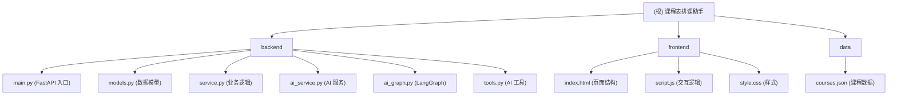

# 课程表排课助手

一个基于 FastAPI + LangGraph 的智能课程排课助手，提供课程管理、时间冲突检测和 AI 对话辅助功能。

## 项目愿景

为家教/培训机构提供简洁易用的课程管理工具，支持：
- 可视化课程日历（拖拽调整时间）
- AI 智能助手（自然语言操作课表）
- 时间冲突自动检测与提醒
- 财务收入统计

## 架构总览

```
┌─────────────────────────────────────────────────────────────────┐
│                         用户界面层                               │
├─────────────────────────────────────────────────────────────────┤
│  ┌──────────────────┐          ┌──────────────────┐            │
│  │   Frontend       │          │   AI Chat Panel  │            │
│  │  (FullCalendar)  │          │  (Streaming UI)  │            │
│  └────────┬─────────┘          └────────┬─────────┘            │
├───────────┼──────────────────────────────┼─────────────────────┤
│           │        REST API              │                     │
├───────────┼──────────────────────────────┼─────────────────────┤
│           ▼                              ▼                     │
│  ┌──────────────────────────────────────────────────┐          │
│  │              FastAPI Backend                     │          │
│  │  ┌─────────────┐  ┌─────────────┐              │          │
│  │  │    main.py  │──│ ai_service.py│              │          │
│  │  │  (Router)   │  │ (Chat Stream)│             │          │
│  │  └──────┬──────┘  └──────┬───────┘              │          │
│  │         │                  │                      │          │
│  │         ▼                  ▼                      │          │
│  │  ┌─────────────┐  ┌─────────────┐              │          │
│  │  │  service.py │  │  ai_graph.py│              │          │
│  │  │   (CRUD)    │  │ (LangGraph) │              │          │
│  │  └──────┬──────┘  └──────┬──────┘              │          │
│  │         │                  │                      │          │
│  │         ▼              ┌───┴──────┐             │          │
│  │  ┌─────────────┐      │  tools.py │             │          │
│  │  │  models.py  │      │(6 Tools)  │             │          │
│  │  │ (Pydantic)  │      └───────────┘             │          │
│  │  └─────────────┘                                │          │
│  └──────────────────────────────────────────────────┘          │
├─────────────────────────────────────────────────────────────────┤
│                    数据存储层                                    │
├─────────────────────────────────────────────────────────────────┤
│           data/courses.json (本地 JSON 文件)                    │
└─────────────────────────────────────────────────────────────────┘
```

## 模块结构图



## 模块索引

| 模块路径 | 语言 | 职责描述 | 文档 |
|---------|------|---------|------|
| `backend/` | Python | FastAPI 后端服务，提供 REST API 和 AI 对话接口 | [查看](./backend/CLAUDE.md) |
| `frontend/` | HTML/JS/CSS | 前端界面，包含日历视图和 AI 聊天面板 | [查看](./frontend/CLAUDE.md) |
| `data/` | JSON | 课程数据持久化存储 | - |

## 运行与开发

### 环境要求

- Python 3.12+
- 依赖包见 `requirements.txt`

### 启动服务

```bash
# 安装依赖
pip install -r requirements.txt

# 启动开发服务器
python -m backend.main
```

服务默认运行在 `http://localhost:9001`

### API 端点

| 方法 | 路径 | 描述 |
|------|------|------|
| GET | `/api/courses` | 获取所有课程 |
| POST | `/api/courses` | 创建新课程 |
| PUT | `/api/courses/{id}` | 更新课程 |
| DELETE | `/api/courses/{id}` | 删除课程 |
| POST | `/api/ai/chat` | AI 对话（流式响应） |

## 测试策略

项目包含 `verify_context.py` 用于验证 AI 对话上下文保持功能：

```bash
python verify_context.py
```

## 编码规范

### 后端 (Python)
- 使用 Pydantic 进行数据验证
- 遵循 FastAPI 最佳实践
- AI 工具函数使用 `@tool` 装饰器定义

### 前端
- 使用原生 JavaScript，无构建工具
- 样式采用 Hello Kitty 粉色主题
- FullCalendar 用于日历渲染

## AI 使用指引

### 关键配置

- **LLM 提供商**: SiliconFlow
- **模型**: zai-org/GLM-4.6
- **配置位置**: `backend/ai_graph.py`

### AI 工具能力

1. `fetch_courses_tool` - 获取所有课程
2. `add_course_tool` - 添加新课程
3. `modify_course_tool` - 修改现有课程
4. `remove_course_tool` - 删除课程
5. `check_availability_tool` - 检查时间可用性
6. `financial_report_tool` - 财务收入统计

### 系统提示词要点

- 添加课程前必须先检查时间冲突
- 保持用户原始输入（不翻译人名、不修改价格）
- 根据当前日期计算相对时间

## 变更记录

### 2026-01-25
- 初始化项目 AI 上下文文档
- 创建根级和模块级 CLAUDE.md
- 生成模块结构图
